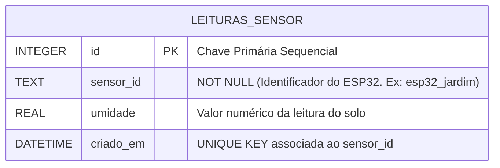
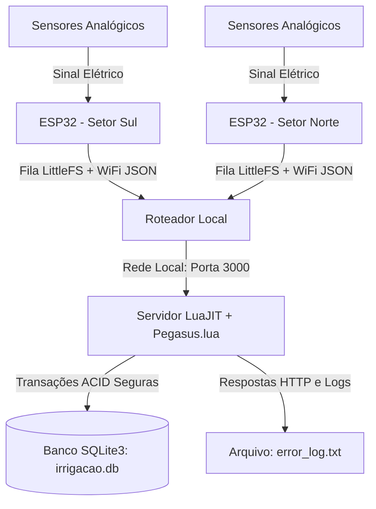
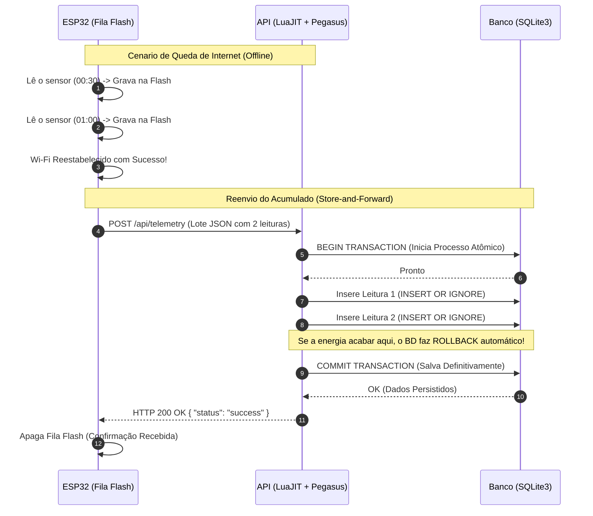

# 💧 Sistema de Irrigação Inteligente - API de Telemetria de Alta Disponibilidade

[](https://luajit.org/)
[](https://github.com/moteus/pegasus.lua)
[](https://sqlite.org/)
[](https://espressif.com/)
[]()

Esta é a API centralizada para recepção, validação, persistência e auditoria de dados de sensores de umidade de solo provenientes de múltiplos módulos ESP32. 

Desenvolvido em **LuaJIT** com o servidor **Pegasus.lua** e banco relacional **SQLite3**, este backend foi projetado sob os princípios de *Edge Computing*. Ele é otimizado para cenários embarcados ou rurais que exigem processamento ultrarrápido, baixíssimo consumo de memória RAM e tolerância extrema a falhas de rede e energia.

---

## 🚀 Tecnologias e Stack Utilizado

A escolha de cada tecnologia foi baseada na necessidade de construir um sistema que nunca trave e que não perca dados sob nenhuma circunstância:

*   **ESP32 & C++ (Hardware):** Microcontroladores dual-core responsáveis pela leitura local (sensores capacitivos/resistivos) e acionamento de relés para as bombas hidráulicas. Possuem memória Flash interna (LittleFS) para armazenamento offline.
*   **LuaJIT (Backend):** Um dos compiladores Just-In-Time mais rápidos do mundo. Eleva a velocidade de execução da API Lua a patamares de C/C++, suportando milhares de requisições por segundo mesmo rodando em hardwares modestos.
*   **Pegasus.lua (Servidor Web):** Framework HTTP/1.1 não-bloqueante. Leve, direto ao ponto e perfeito para construir rotas RESTful sem o peso de frameworks gigantes.
*   **SQLite3 (Banco de Dados):** Banco de dados relacional embutido na aplicação (Serverless DB). Configurado com suporte total a transações **ACID** (Atomicidade, Consistência, Isolamento, Durabilidade). Elimina latências de rede entre a API e o banco.
*   **Lua-CJSON:** Biblioteca escrita em C para parsing e serialização de pacotes JSON, garantindo que o processamento do payload dos ESP32 ocorra em frações de milissegundo.

---

## 📂 Estrutura de Diretórios e Modularização (Clean Code)

O projeto foi refatorado utilizando o *Single Responsibility Principle (SRP)*. Cada arquivo faz apenas uma coisa, garantindo que um erro de rota não quebre a conexão com o banco, e vice-versa.

```text
api-irrigacao/
├── server.lua               # Ponto de entrada. Inicia o Pegasus protegido por xpcall()
├── error_log.txt            # (Gerado automaticamente) Log físico de auditoria de falhas
├── init_db.lua              # Script independente para criação das tabelas SQLite
└── backend/
    ├── config.lua           # Variáveis globais de ambiente (Porta, IP, Path do BD)
    ├── db/
    │   ├── connection.lua   # Singleton: Garante apenas uma conexão aberta com o SQLite3
    │   └── telemetry_db.lua # Camada DAO: Queries SQL e Transações ACID (BEGIN/COMMIT)
    ├── routes/
    │   └── telemetry.lua    # Controller: Valida JSON, checa campos e responde HTTP 200/400
    └── utils/
        ├── response.lua     # Helper: Padroniza os headers e o formato JSON de saída
        └── logger.lua       # Módulo: Captura stack trace de erros e salva em arquivo
```

---

## 💾 Arquitetura de Resiliência: Store-and-Forward

Em ambientes agrícolas ou estufas, a rede Wi-Fi frequentemente oscila ou cai. Para garantir **Zero Perda de Dados**, o firmware do ESP32 e a API trabalham juntos no padrão **Store-and-Forward (Armazenar e Encaminhar)**:

1.  **Store (Armazenamento Seguro):** O ESP32 realiza leituras a cada 30 segundos. Se a API estiver offline ou o Wi-Fi cair, o ESP32 não descarta a leitura. Ele empacota o dado em JSON, insere um timestamp temporal (via relógio interno RTC/NTP) e grava isso em um arquivo físico na memória Flash do ESP32 (`LittleFS`).
2.  **Forward (Despacho em Lote):** Assim que a conexão retorna, o ESP32 agrupa todas as leituras acumuladas na memória e as envia de uma só vez para o servidor Lua em uma única requisição POST.
3.  **Handshake de Confirmação:** O ESP32 **só apaga** o arquivo da sua memória Flash após o servidor LuaJIT responder explicitamente com um `HTTP 200 OK`. Se a energia acabar no meio do envio, o ESP32 tentará novamente ao religar.

---

## 📊 Diagramas Visuais do Sistema

### 1. Arquitetura do Banco de Dados (ER)
O banco foi modelado para rejeitar dados duplicados. Como o ESP32 pode tentar reenviar o mesmo lote se o Wi-Fi piscar durante a resposta, criamos uma **chave única composta** (`sensor_id` + `criado_em`). A instrução `INSERT OR IGNORE` garante que o servidor ignore pacotes repetidos silenciosamente.



### 2. Fluxo da Rede Física
Como os dispositivos se comunicam até chegar ao processamento de transações.



### 3. Diagrama de Sequência de Transações (Tolerância a Falhas)
Este fluxo explica a lógica de proteção caso a rede caia e como o sistema se recupera de forma automática.



---

## 🛠️ Guia de Instalação e Execução

### 1. Pré-requisitos de Sistema (Linux/Ubuntu/Debian)
Você precisa do LuaJIT, gerenciador de pacotes LuaRocks e dos cabeçalhos em C do SQLite instalados no sistema operacional.

```bash
sudo apt update
sudo apt install luajit luarocks sqlite3 libsqlite3-dev
```

### 2. Instalação de Dependências do Projeto
Use o LuaRocks para baixar as bibliotecas necessárias do nosso ecossistema:

```bash
sudo luarocks install pegasus
sudo luarocks install lsqlite3complete
sudo luarocks install lua-cjson
```

### 3. Inicialização do Servidor
Com todas as dependências instaladas, basta executar o servidor em modo contínuo:

```bash
luajit server.lua
```
*O servidor iniciará escutando conexões de qualquer IP (`0.0.0.0`) na porta **3000**.*

---

## 🛣️ Documentação dos Endpoints da API

A API trabalha estritamente com requisições e respostas no padrão JSON (`application/json`).

### 1. Receber Lotes de Telemetria (ESP32)
*   **Rota:** `/api/telemetry`
*   **Método:** `POST`
*   **Descrição:** Rota principal utilizada pelos ESP32. Recebe a carga útil e realiza a inserção através de uma transação SQL `BEGIN/COMMIT`. 

**Exemplo de Payload (Request):**
```json
{
  "sensor_id": "esp32_teste_lote",
  "leituras": [
    {"umidade": 45.2, "timestamp": "2026-09-17 14:00:00"},
    {"umidade": 44.8, "timestamp": "2026-09-17 14:00:30"}
  ]
}
```

**Exemplo de Resposta de Sucesso (HTTP 200 OK):**
```json
{
  "status": "success",
  "message": "Lote processado e armazenado com sucesso",
  "inserted_count": 2
}
```

**Exemplo de Resposta de Erro (HTTP 400 Bad Request):**
```json
{
  "status": "error",
  "message": "O campo 'sensor_id' é obrigatório e deve ser uma string não vazia"
}
```

### 2. Consultar Últimas Leituras (Dashboard/Admin)
*   **Rota:** `/api/umidade`
*   **Método:** `GET`
*   **Descrição:** Retorna as medições ordenadas das mais recentes para as mais antigas, prontas para gerar gráficos de monitoramento.

**Exemplo de Resposta (HTTP 200 OK):**
```json
[
  {
    "id": 2,
    "sensor_id": "esp32_teste_lote",
    "umidade": 44.8,
    "criado_em": "2026-09-17 14:00:30"
  },
  {
    "id": 1,
    "sensor_id": "esp32_teste_lote",
    "umidade": 45.2,
    "criado_em": "2026-09-17 14:00:00"
  }
]
```

---

## 🛡️ Segurança: Tratamento de Exceções e Auditoria

Diferente de scripts Lua convencionais que fecham o processo ao encontrar um erro, esta API foi blindada estruturalmente:

1.  **Tratamento de Crash Global (xpcall):** Toda a lógica do servidor web é envelopada pela função nativa `xpcall`. Isso significa que se um código quebrado tentar rodar, o servidor captura a falha, devolve um `HTTP 500` e **mantém a porta 3000 ativa e operante**.
2.  **Garantia ACID no Banco de Dados:** Nenhuma leitura é salva "pela metade". Se o ESP32 enviar um JSON com 50 leituras e a 49ª contiver um erro de sintaxe ou problema no banco de dados, o comando `ROLLBACK` é acionado. Nenhuma das 50 é gravada, prevenindo sujeira na base.
3.  **Logger Físico (`error_log.txt`):** Se o sistema interceptar um erro de compilação ou de SQL, um *Traceback* completo da pilha de memória é automaticamente salvo neste arquivo `.txt`, permitindo que o desenvolvedor saiba o arquivo, a linha exata e a hora em que o erro ocorreu, sem precisar olhar para a tela do terminal.